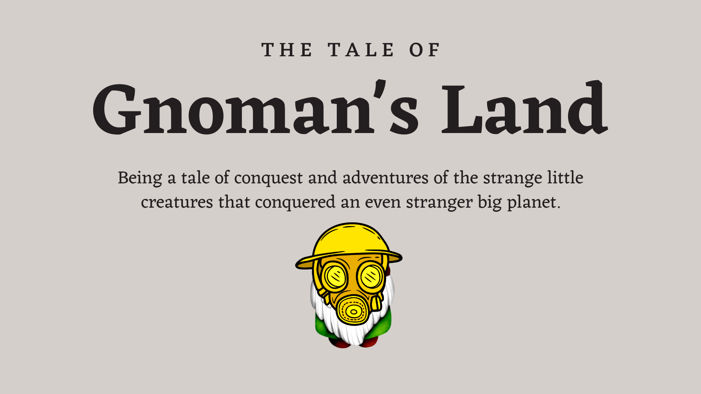

<!--
*** Thanks for checking out the GnomansLand. If you have a suggestion
*** that would make this better, please fork the repo and create a pull request
*** or simply open an issue with the tag "enhancement".
*** Don't forget to give the project a star!
*** Thanks again! Now go create something AMAZING! :D
-->

<!-- PROJECT SHIELDS -->
<!--
*** I'm using markdown "reference style" links for readability.
*** Reference links are enclosed in brackets [ ] instead of parentheses ( ).
*** See the bottom of this document for the declaration of the reference variables
*** for contributors-url, forks-url, etc. This is an optional, concise syntax you may use.
*** https://www.markdownguide.org/basic-syntax/#reference-style-links
-->

[![Contributors][contributors-shield]][contributors-url]
[![Forks][forks-shield]][forks-url]
[![Stargazers][stars-shield]][stars-url]
[![Issues][issues-shield]][issues-url]
[![MIT License][license-shield]][license-url]
[![LinkedIn][linkedin-shield]][grahamwaters-linkedin-url]

<!-- PROJECT LOGO -->
 

  

  <h3 align="center">GnomansLand</h3>

  <h4 alight="center">(Aquapac Games)</h4>

  

    The simulated world where gnomes rule and thrive while avoiding the perils of a dangerous planet.
     
    <a href="https://github.com/grahamwaters/GnomansLand"><strong>Explore the docs »</strong></a>
     
    <a href="https://github.com/grahamwaters/GnomansLand/issues">Report Bug</a>
    ·
    <a href="https://github.com/grahamwaters/GnomansLand/issues">Request Feature</a>
  

Feel free to share this project on Twitter!

## Introduction

What is GnomansLand?
Gnomans Land is an MMORTS (Massively Multiplayer Online Real-Time Strategy) game that mixes all the best parts of Clash of Clans, Age of Empires (OG), Minecraft, Minedustry, and Stardew Valley. Without giving too much away, the minimum viable product can be summed up as a game where players build their own civilizations of reinforcement learning agents (gnomes) that they then train (oversee the training in god mode) to survive against the elements, disease, and predators. The game's objective is to build a robust population of trained gnomes, which can be drafted into an army to conquer an open-world space or develop new cities and expand their empire. The area they can travel in will contain the actual towns of other players at random intervals. Remember Stronghold Crusader 2? Similar to that. The game will have a Minecraft-like world and likely involve resource management, combat, and strategy elements.

Some History on the idea
This project started as a simple exercise in the use of pygame and OpenAI to create reinforcement agents. But with time it became something else entirely. It grew into a fascinatingly organic (theoretically open-world) mixture of Minecraft, Age of empires (from the good old days), fallout shelter, and NetLogo. We are building a virtual experience for our Gnomes and watching them learn. They must learn or they will die out. Using concepts introduced in genetic algorithms and natural selection we hope to program this civilization to stay alive and even thrive in their post-apocalyptic survival society where they not only have to hunt and gather to stay alive, but must adapt to changing conditions and learn on the go.

<!-- TABLE OF CONTENTS -->
- [Introduction](#introduction)
- [An Outline of the Game](#an-outline-of-thegame)
- [Ideas for the Future](#ideas-for-the-future)
- [The Environment](#the-environment)
- [We are looking for Contributors in the Following Areas](#we-are-looking-for-contributors-in-the-following-areas)
- [Some ideas have already been shared, here are three examples:](#some-ideas-have-already-been-shared-here-are-three-examples)
  - [Built With (Prerequisites)](#built-with-prerequisites)
- [Getting Started](#getting-started)
- [Usage Examples](#usage-examples)
- [Our Development Roadmap](#our-development-roadmap)
- [Observation Space Specs](#observation-space-specs)
- [Contributing](#contributing)
- [License](#license)
- [Contributors](#contributors)
  - [Graham Waters ](#graham-waters-)
  - [Nora Abuassaf ](#nora-abuassaf-)
- [Contact](#contact)
- [Acknowledgments](#acknowledgments)

<!-- ABOUT THE PROJECT -->

## An Outline of the Game

The gameflow is divided into six phases, each with its own unique and novel challenge for the gnomes. These different challenges for the reinforcement learning agents are to build their mastery (ideally) before the next chapter begins; however, if the population does not learn the necessary skills before the chapter ends, they could be annihilated resulting in a game over scenario.

![Product Name Screen Shot][panel1]
![Product Name Screen Shot][panel2]
![Product Name Screen Shot][panel3]
![Product Name Screen Shot][panel4]
![Product Name Screen Shot][panel5]
![Product Name Screen Shot][panel6]
![Product Name Screen Shot][panel7]
![Product Name Screen Shot][panel8]
![Product Name Screen Shot][panel9]
![Product Name Screen Shot][panel10]
![Product Name Screen Shot][panel11]

## Ideas for the Future
To make the game immersive, players could be given the option to play as a gnome, or as a force entity. The "force entity" is a god-like creature that can interact with the environment by directing gnomes to tasks like Age of Empires or other god-mode RTS openworld games.

## The Environment
The space where the agents live should be generative in that it adapts as it learns from how the gnomes and players interact with it. So, the environment is an agent itself.
*see Meta's work on the E3B Algorithm * [repo here](https://github.com/facebookresearch/e3b)
*also see their paper on Exploration via Elliptical Episodic Bonuses * [paper here](https://arxiv.org/abs/2210.05805)

## We are looking for Contributors in the Following Areas

- We are looking to build our game in Unity3d. If you are a Unity expert, or are familiar with using ML in Unity3d, then you have a place with us.

- Genetic Algorithms are often complex. If you have experience coding these or other machine learning algorithms, then reach out, and we can find a task to assign to you.
- Graph optimization
- Agent Behavior modification through policy generation
- Game Art
- Game Story Flow
- Repository Maintenance and Organization
- Code Security on GitHub
- All Machine Learning Experts
- Experienced C# Developers for Unity Scripts

## Some ideas have already been shared, here are three examples:

- Enable the gnomes to reproduce, resulting in nuclear attribute inheritance (Yes, we will assume the inheritance of acquired characteristics).
- We are using shared crowd knowledge to enhance the resource optimization of hunter-gatherers.
- We are applying Genetic Algorithms and Stamina/Strength/Motivation to the abilities and lives of the Gnomes.
<!-- @import "[TOC]" {cmd="toc" depthFrom=1 depthTo=6 orderedList=false} -->

(<a href="#top">back to top</a>)

### Built With (Prerequisites)

The primary tools used for development in this project are python, scikit-learn, pandas, matplotlib, and some others.

- [Python3](https://www.python.org/download/releases/3.0/)
- PyGame
- Scikit-Learn
- Pandas
- Matplotlib
- (potentially Unity)

(<a href="#top">back to top</a>)

<!-- GETTING STARTED -->

## Getting Started

To get started setting up your project locally follow these simple steps.

1. Fork the Project
2. clone the repository to edit it locally on your computer: `git clone https://github.com/grahamwaters/GnomansLand.git`
3. `cd` into the repository folder: `cd GnomansLand`
4. Create a conda environment named GnomansLand: `conda env create -n GnomansLand --file gnomansland_contributor.yml`
5. Activate the environment: `conda activate GnomansLand`
   1. You should see `(GnomansLand)` to the left of your terminal prompt now.
6. If you like using the terminal then you could create your Feature Branch using this command: (`git checkout -b feature/AmazingFeature`)
   1. I recommend using either SourceTree or GitHub Desktop for tracking version control and making branches etc.
7. Commit your Changes (`git commit -m 'Add some AmazingFeature'`) or in those programs from step 6.
8. Before pushing your commits to your `feature/AmazingFeature` branch, go ahead and run `black` and `flake8` to eliminate any merge issues before they happen. This ensures your work is more likely to be merged into the main branch.
   1. `black (path to your file)`
   2. `flake8 (path to your file)`
9. Push to the Branch (`git push origin feature/AmazingFeature`)
10. Open a Pull Request
11. Wait for an admin to approve your changes and merge them into the main branch.

(<a href="#top">back to top</a>)

<!-- USAGE EXAMPLES -->

## Usage Examples

Usage will be added here once there is a working product to illustrate.

_For more examples, please refer to the [Documentation](https://github.com/grahamwaters/GnomansLand/blob/master/Genesis.md)_

(<a href="#top">back to top</a>)

<!-- ROADMAP -->

## Our Development Roadmap

- [ ] Create the observation space (environment) for the project.
- [ ] Create Gnome Classes with personality traits and physical attributes.
- [ ] Place the Gnome in the observation space.
- [ ] Define a Gnome Abilities Class to denote all possible actions that the agent can take within the observation space.
- [ ] Use reinforcement learning to generate policies for the gnome that allow it to survive.
  - [ ] Gather Food
  - [ ] Avoid Danger

See the [open issues](https://github.com/grahamwaters/GnomansLand/issues) for a full list of proposed features (and known issues).

(<a href="#top">back to top</a>)

## Observation Space Specs

- [ ] Generate an isometric tilemap for the world at the moment of creation.

![isometric map][iso1]

As you can see in the map above, there are multiple features (sprites) that have spawned on this map. These features will be variant. They could be animals, plants, and even geographic features.

![isometric map][iso2]

In this map you can see features that would have to be created by an agent. Paths would be gnome-made. Now, what would be ideal is if we can get our map so well designed and streamlined that it can look like the image below.

![isometric map][iso_goal]

This is the goal, and the dream of this project. It may require Unity eventually.

<!-- CONTRIBUTING -->

## Contributing

Contributions are what make the open source community such an amazing place to learn, inspire, and create. Any contributions you make are **greatly appreciated**.

If you have a suggestion that would make this better, please fork the repo and create a pull request. You can also simply open an issue with the tag "enhancement".
Don't forget to give the project a star! Thanks again! Welcome to your Gnome away from home.

(<a href="#top">back to top</a>)

<!-- LICENSE -->

## License

Distributed under the MIT License. See `LICENSE.txt` for more information.

(<a href="#top">back to top</a>)

## Contributors

### Graham Waters [![LinkedIn][linkedin-shield]][grahamwaters-linkedin-url]

### Nora Abuassaf [![LinkedIn][linkedin-shield]][nura-linkedin-url]

<!-- CONTACT -->

## Contact

If you have questions or concerns about the project, or just want to chat about Gnomes, feel free to reach out to me on my social media.

- Graham Waters - [@grahamwaters01](https://www.linkedin.com/in/grahamwaters01/)

- My Medium Page - [@grahamwaters]([https://grahamwaters.medium.com/)

(<a href="#top">back to top</a>)

<!-- ACKNOWLEDGMENTS -->

## Acknowledgments

- https://k3no.medium.com/isometric-grids-in-python-40c0fad54552
- [Img Shields](https://shields.io)
- [Read Me Template](https://github.com/othneildrew/Best-README-Template)

(<a href="#top">back to top</a>)

<!-- MARKDOWN LINKS & IMAGES -->
<!-- https://www.markdownguide.org/basic-syntax/#reference-style-links -->

[contributors-shield]: https://img.shields.io/github/contributors/grahamwaters/GnomansLand.svg?style=for-the-badge
[contributors-url]: https://github.com/grahamwaters/GnomansLand/graphs/contributors
[forks-shield]: https://img.shields.io/github/forks/grahamwaters/GnomansLand.svg?style=for-the-badge
[forks-url]: https://github.com/grahamwaters/GnomansLand/network/members
[stars-shield]: https://img.shields.io/github/stars/grahamwaters/GnomansLand.svg?style=for-the-badge
[stars-url]: https://github.com/grahamwaters/GnomansLand/stargazers
[issues-shield]: https://img.shields.io/github/issues/grahamwaters/GnomansLand.svg?style=for-the-badge
[issues-url]: https://github.com/grahamwaters/GnomansLand/issues
[license-shield]: https://img.shields.io/github/license/grahamwaters/GnomansLand.svg?style=for-the-badge
[license-url]: https://github.com/grahamwaters/GnomansLand/blob/master/LICENSE.txt
[linkedin-shield]: https://img.shields.io/badge/-LinkedIn-black.svg?style=for-the-badge&logo=linkedin&colorB=555
[nura-linkedin-url]: https://www.linkedin.com/in/nura-abuassaf/
[grahamwaters-linkedin-url]: https://linkedin.com/in/grahamwaters01
[product-screenshot]: images/screenshot.png
[iso1]: images/example_isometric_scene.png
[iso2]: images/example_isometricscene2.png
[iso_goal]: images/goal_visual_iso.jpg
[panel1]: images/1.png
[panel2]: images/2.png
[panel3]: images/4.png
[panel4]: images/5.png
[panel5]: images/6.png
[panel6]: images/7.png
[panel7]: images/8.png
[panel8]: images/11.png
[panel9]: images/12.png
[panel10]: images/16.png
[panel11]: images/17.png
