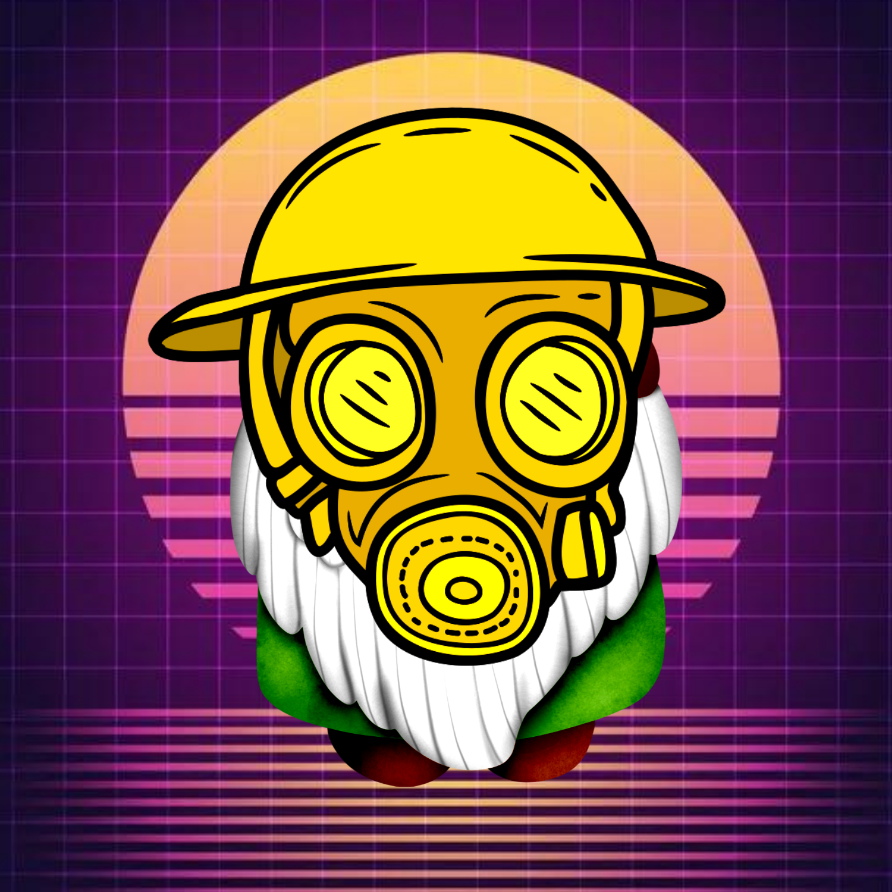

<div id="top"></div>
<!--
*** Thanks for checking out the GnomansLand. If you have a suggestion
*** that would make this better, please fork the repo and create a pull request
*** or simply open an issue with the tag "enhancement".
*** Don't forget to give the project a star!
*** Thanks again! Now go create something AMAZING! :D
-->


<!-- PROJECT SHIELDS -->
<!--
*** I'm using markdown "reference style" links for readability.
*** Reference links are enclosed in brackets [ ] instead of parentheses ( ).
*** See the bottom of this document for the declaration of the reference variables
*** for contributors-url, forks-url, etc. This is an optional, concise syntax you may use.
*** https://www.markdownguide.org/basic-syntax/#reference-style-links
-->

[![Contributors][contributors-shield]][contributors-url]
[![Forks][forks-shield]][forks-url]
[![Stargazers][stars-shield]][stars-url]
[![Issues][issues-shield]][issues-url]
[![MIT License][license-shield]][license-url]

[![LinkedIn][linkedin-shield]][linkedin-url]


<!-- PROJECT LOGO -->
<br />
<div align="center">
  <a href="https://github.com/grahamwaters/GnomansLand">
    
  </a>

  <h3 align="center">GnomansLand</h3>

  <h4 alight="center">(by Graham Waters)</h4>

  <p align="center">
    The simulated world where gnomes rule and thrive while avoiding the perils of a dangerous planet.
    <br />
    <a href="https://github.com/grahamwaters/GnomansLand"><strong>Explore the docs »</strong></a>
    <br />
    <a href="https://github.com/grahamwaters/GnomansLand/issues">Report Bug</a>
    ·
    <a href="https://github.com/grahamwaters/GnomansLand/issues">Request Feature</a>
  </p>
</div>

Feel free to share this project on Twitter!

[](https://twitter.com/intent/tweet?text=Get%20over%20170%20free%20design%20blocks%20based%20on%20Bootstrap%204&url=https://froala.com/design-blocks&via=froala&hashtags=bootstrap,design,templates,blocks,developers)

<!-- TABLE OF CONTENTS -->
<details>
  <summary>Table of Contents</summary>
  <ol>
    <li>
      <a href="#about-the-project">About the project</a>
      <ul>
        <li><a href="#built-with">Built With</a></li>
      </ul>
    </li>
    <li>
      <a href="#getting-started">Getting Started</a>
      <ul>
        <li><a href="#prerequisites">Prerequisites</a></li>
        <li><a href="#installation">Installation</a></li>
      </ul>
    </li>
    <li><a href="#usage">Usage</a></li>
    <li><a href="#roadmap">Roadmap</a></li>
    <li><a href="#contributing">Contributing</a></li>
    <li><a href="#license">License</a></li>
    <li><a href="#contact">Contact</a></li>
    <li><a href="#acknowledgments">Acknowledgments</a></li>
  </ol>
</details>


<!-- ABOUT THE PROJECT -->
## About The Project

[![Product Name Screen Shot][product-screenshot]]

This project started as a simple exercise in the use of pygame and reinforcement agents and grew into a fascinatingly organic (theoretically open-world) mixture of minecraft, age of empires, fallout shelter, and NetLogo. We are building a semi-open world virtual wilderness for our Gnomes. They live in a post-apocolypic survival society where they have to hunt and gather to stay alive.

There are many Interesting subtasks within this project:
* (Keeping it PG) Integration of Gnomes having children, resulting in attribute inheritence.
* Resource Optimization in the enviornment.
* Genetic Algorithm Application for the life of the Gnomes.

At the very least we are building a virtual space where Gnomes live and interact. They must gather to survive, and avoid dangers that are randomly placed throughout the action-space.


<p align="right">(<a href="#top">back to top</a>)</p>


### Built With (Prerequisites)

The primary tools used for development in this project are python, scikit-learn, pandas, matplotlib, and some others.

* [Python3](https://www.python.org/download/releases/3.0/)
* PyGame
* Scikit-Learn
* Pandas
* Matplotlib
* (potentially Unity)


<p align="right">(<a href="#top">back to top</a>)</p>


<!-- GETTING STARTED -->
## Getting Started

To get started setting up your project locally follow these simple steps.

If you don't already have the prerequisites installed and ready to go then use pip to install them in a new conda environment.
  ```sh
  pip install pandas etc...
  ```

### Installation

_Below you will find instructions on how you can install and set up your app._

1. Clone the repo
```sh
    git clone https://github.com/grahamwaters/GnomansLand
```
2. Install pip packages
```sh
    pip install ...
```


<p align="right">(<a href="#top">back to top</a>)</p>


<!-- USAGE EXAMPLES -->
## Usage

Use this space to show useful examples of how a project can be used. Additional screenshots, code examples and demos work well in this space. You may also link to more resources.

_For more examples, please refer to the [Documentation](https://example.com)_

<p align="right">(<a href="#top">back to top</a>)</p>


<!-- ROADMAP -->
## Our Development Roadmap

- [ ] Create the observation space (environment) for the project.
- [ ] Create Gnome Classes with personality traits and physical attributes.
- [ ] Place the Gnome in the observation space.
- [ ] Define a Gnome Abilities Class to denote all possible actions that the agent can take within the observation space.
- [ ] Use reinforcement learning to generate policies for the gnome that allow it to survive.
    - [ ] Gather Food
    - [ ] Avoid Danger

See the [open issues](https://github.com/grahamwaters/GnomansLand/issues) for a full list of proposed features (and known issues).

<p align="right">(<a href="#top">back to top</a>)</p>

## Observation Space Specs

- [ ] Generate an isometric tilemap for the world at the moment of creation.

![isometric map][iso1]
As you can see in the map above, there are multiple features (sprites) that have spawned on this map. These features will be variant. They could be animals, plants, and even geographic features.
![isometric map][iso2]
In this map you can see features that would have to be created by an agent. Paths would be gnome-made. Now, what would be ideal is if we can get our map so well designed and streamlined that it can look like the image below.
![isometric map][iso_goal]
This is the goal, and the dream of this project. It may require Unity eventually.

<!-- CONTRIBUTING -->
## Contributing

Contributions are what make the open source community such an amazing place to learn, inspire, and create. Any contributions you make are **greatly appreciated**.

If you have a suggestion that would make this better, please fork the repo and create a pull request. You can also simply open an issue with the tag "enhancement".
Don't forget to give the project a star! Thanks again! Welcome to your Gnome away from home.

1. Fork the Project
2. Create your Feature Branch (`git checkout -b feature/AmazingFeature`)
3. Commit your Changes (`git commit -m 'Add some AmazingFeature'`)
4. Before pushing your commits go ahead and run `black` and `flake8` to eliminate any merge issues before they happen. This ensures your work is more likely to be merged into the main branch.
5. Push to the Branch (`git push origin feature/AmazingFeature`)
6. Open a Pull Request
7. Wait for an admin to approve your changes and merge them into the main branch.

<p align="right">(<a href="#top">back to top</a>)</p>


<!-- LICENSE -->
## License

Distributed under the MIT License. See `LICENSE.txt` for more information.

<p align="right">(<a href="#top">back to top</a>)</p>


<!-- CONTACT -->
## Contact
If you have questions or concerns about the project, or just want to chat about Gnomes, feel free to reach out to me on my social media.

* Graham Waters - [@grahamwaters01](https://www.linkedin.com/in/grahamwaters01/)

* My Medium Page - [@grahamwaters]([https://grahamwaters.medium.com/)


<p align="right">(<a href="#top">back to top</a>)</p>


<!-- ACKNOWLEDGMENTS -->
## Acknowledgments

Use this space to list resources you find helpful and would like to give credit to. I've included a few of my favorites to kick things off!


* [Img Shields](https://shields.io)
* [Read Me Template](https://github.com/othneildrew/Best-README-Template)

<p align="right">(<a href="#top">back to top</a>)</p>


<!-- MARKDOWN LINKS & IMAGES -->
<!-- https://www.markdownguide.org/basic-syntax/#reference-style-links -->
[contributors-shield]: https://img.shields.io/github/contributors/grahamwaters/GnomansLand.svg?style=for-the-badge
[contributors-url]: https://github.com/grahamwaters/GnomansLand/graphs/contributors
[forks-shield]: https://img.shields.io/github/forks/grahamwaters/GnomansLand.svg?style=for-the-badge
[forks-url]: https://github.com/grahamwaters/GnomansLand/network/members
[stars-shield]: https://img.shields.io/github/stars/grahamwaters/GnomansLand.svg?style=for-the-badge
[stars-url]: https://github.com/grahamwaters/GnomansLand/stargazers
[issues-shield]: https://img.shields.io/github/issues/grahamwaters/GnomansLand.svg?style=for-the-badge
[issues-url]: https://github.com/grahamwaters/GnomansLand/issues
[license-shield]: https://img.shields.io/github/license/grahamwaters/GnomansLand.svg?style=for-the-badge
[license-url]: https://github.com/grahamwaters/GnomansLand/blob/master/LICENSE.txt
[linkedin-shield]: https://img.shields.io/badge/-LinkedIn-black.svg?style=for-the-badge&logo=linkedin&colorB=555

[linkedin-url]: https://linkedin.com/in/grahamwaters01
[product-screenshot]: images/screenshot.png
[iso1]: images/example_isometric_scene.png
[iso2]: images/example_isometricscene2.png
[iso_goal]: images/goal_visual_iso.jpg