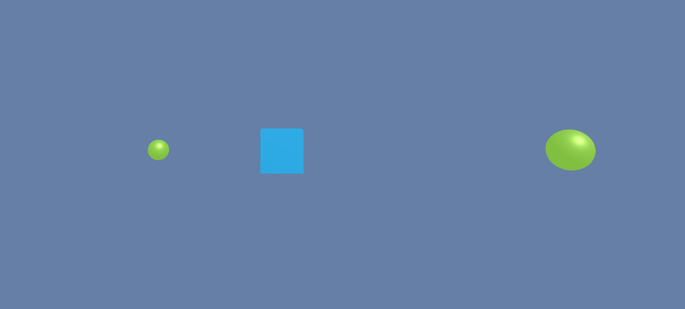
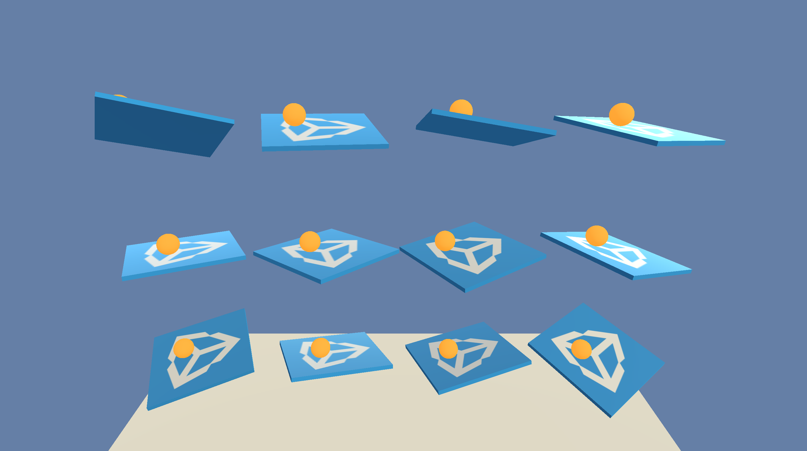
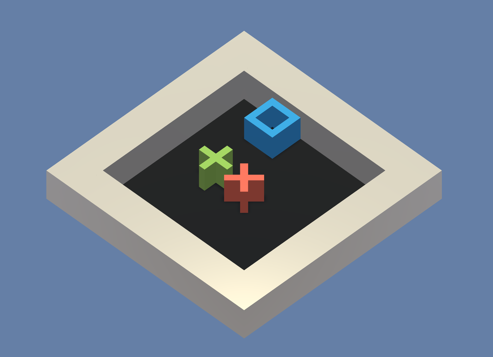
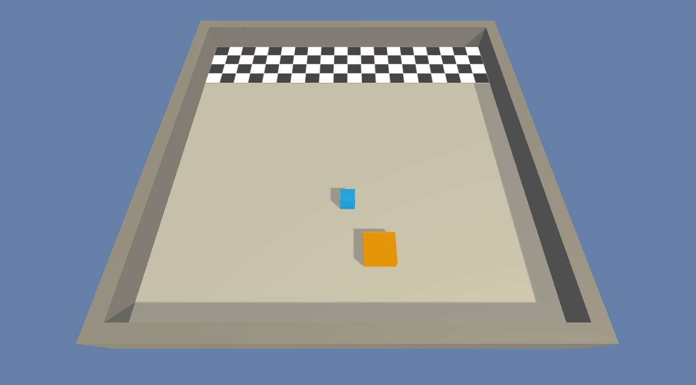
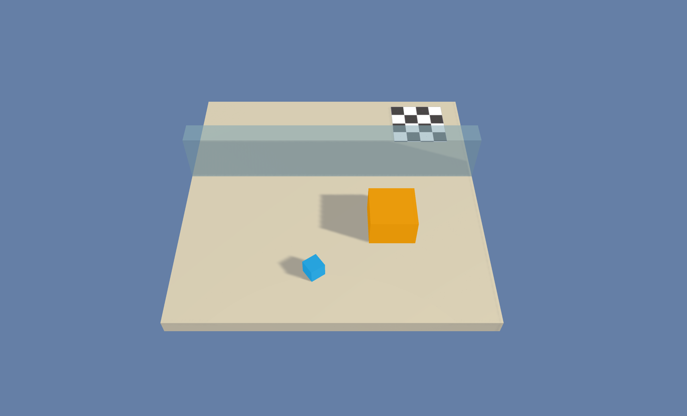
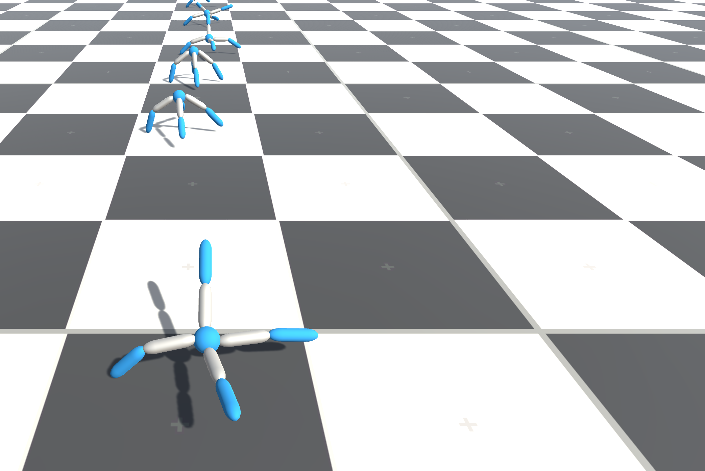
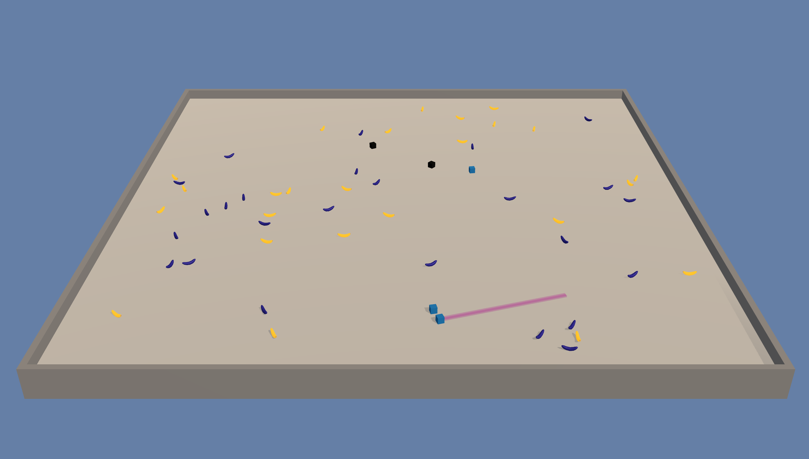
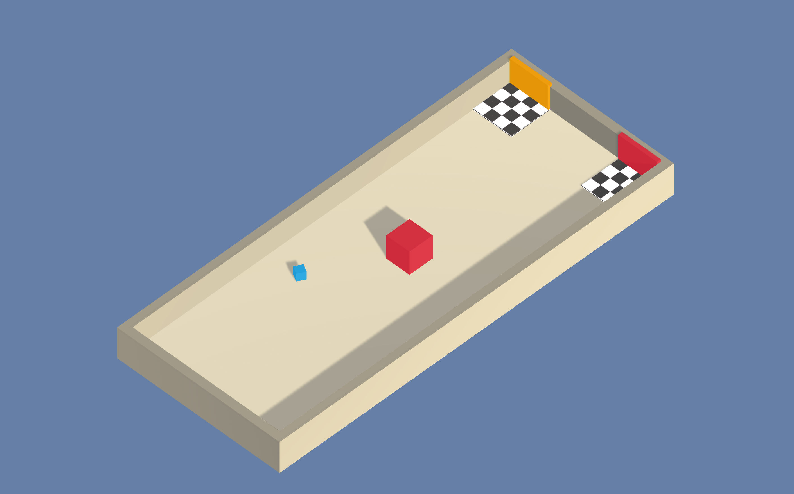
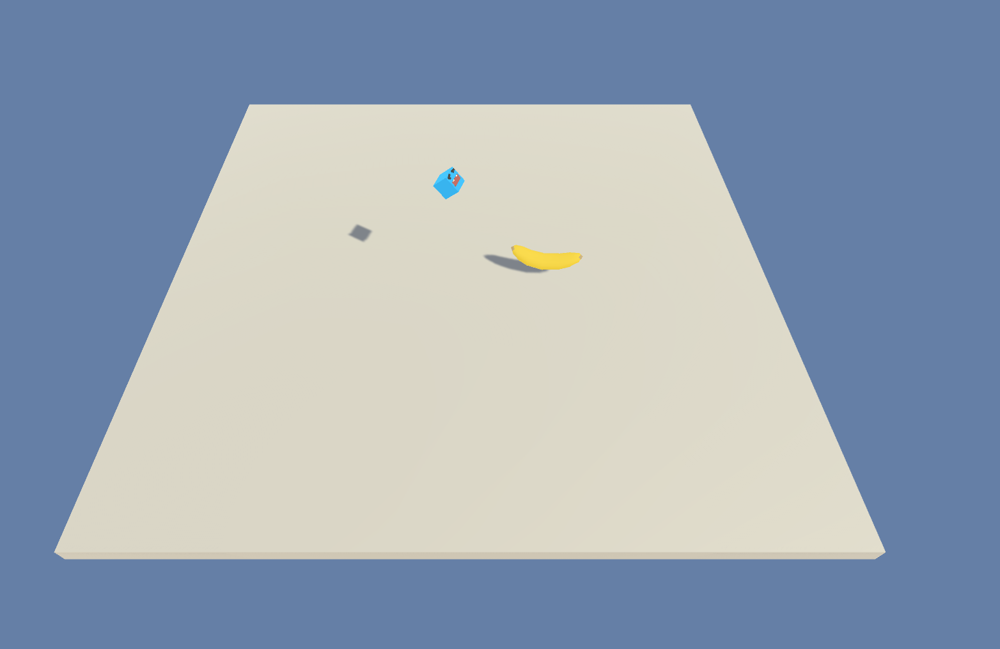
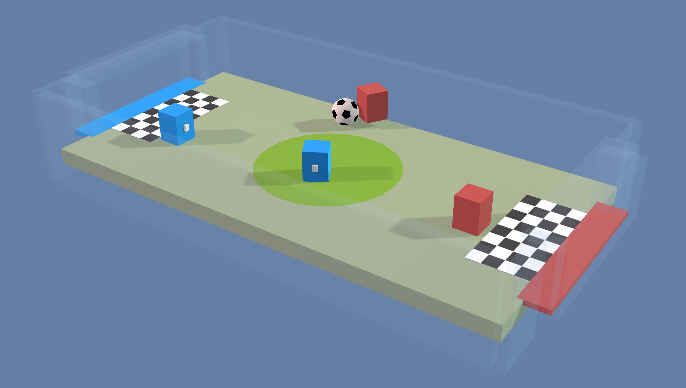

# 学习环境示例

Unity ML-Agents 工具包中内置了一些搭建好的学习环境的示例，并且我们还在不断增加新的示例，这些示例演示了该平台的各种功能。示例环境位于
`unity-environment/Assets/ML-Agents/Examples` 中，并且我们在下文中进行了简单的介绍。
此外，我们的
[首届 ML-Agents 挑战赛](https://connect.unity.com/challenges/ml-agents-1)
中包含了由社区成员创建的一些环境示例。

此页仅概述了我们提供的示例环境。如果想要更多地学习如何设计和构建您自己的环境，请参阅
[创建新的学习环境](Learning-Environment-Create-New.md)
页面。

如果您想提交自己的环境，请参阅我们的
[贡献指南](/com.unity.ml-agents/CONTRIBUTING.md)页面。

## Basic

* 训练环境：一种线性移动任务，在此任务中 agent 必须向左或向右移动到奖励状态。
* 目标：移动到最高奖励状态。
* Agent设置：环境包含一个 agent，上面附带了单个 Brain。
* Agent 奖励函数设置：
    * 达到次优状态时 +0.1。
    * 达到最优状态时 +1.0。
* Brain 设置：一个有以下观测/运动空间的 Brain。
    * 向量观测空间：（离散变量）一个变量，对应于当前状态。
    * 向量运动空间：（离散变量）两个可能的动作（向左移动、向右移动）。
    * 视觉观测：0
* 重置参数：无

## 3DBall: 3D Balance Ball

* 训练环境：一种平衡球任务，在此任务中 agent 需要控制平台。
* 目标：agent 必须平衡平台，以尽可能长时间在平台上保持球不掉落。
* Agent设置：环境包含 12 个全部链接到单个 Brain 的同类 agent。
* Agent 奖励函数设置：
    * 球在平台上保持不掉下的每一步都 +0.1。
    * 球掉下平台时 -1.0。
* Brain 设置：一个有以下观测/运动空间的 Brain。
    * 向量观测空间：（连续变量）8 个，对应于平台的旋转以及球的位置、旋转和速度。
    * 向量观测空间（困难版本，因为观测到的信息减少了）：（连续变量）5 个变量，对应于平台的旋转以及球的位置和旋转。
    * 向量运动空间：（连续变量）2 个，其中一个值对应于 X 旋转，而另一个值对应于 Z 旋转。
    * 视觉观测：0
* 重置参数：无

## GridWorld

* 训练环境：某一个典型版本的的grid-world任务。场景包含 agent、目标和障碍。
* 目标：agent 必须在网格中避开障碍的同时移动到目标。
* Agent设置：环境包含一个链接到单个 Brain 的 agent。
* Agent 奖励函数设置：
    * 每一步 -0.01。
    * agent 导航到目标网格位置时 +1.0（场景结束）。
    * agent 移动到障碍物时 -1.0（场景结束）。
* Brain 设置：一个有以下观测/运动空间的 Brain。
    * 向量观测空间：无
    * 向量运动空间：（离散变量）4 个，对应于基本方向的移动。
    * 视觉观测：一个对应于 GridWorld 自上而下的视图。
* 重置参数：三个参数，分别对应于网格大小、障碍物数量和目标数量。

## Tennis

* 训练环境：agent 控制球拍将球弹过球网的双人游戏。
* 目标：agent 必须在彼此之间弹起网球，同时不能丢球或击球出界。
* Agent设置：环境包含两个链接到单个 Brain TennisBrain）的 agent。在训练之后，您可以将另一个名为 MyBrain 的 Brain 附加到其中一个 agent，从而与经过训练的模型进行游戏比赛。
* Agent 奖励函数设置（agent互相之间独立）：
    * agent 击球过网时 +0.1。
    * agent 让球落入自己的范围或者击球出界时 -0.1。
* Brain 设置：一个有以下观测/运动空间的 Brain。
    * 向量观测空间：（连续变量）8 个，分别对应于球和球拍的位置和速度。
    * 向量运动空间：（连续变量）2 个，分别对应于朝向球网或远离球网的运动，以及上下的运动。
    * 视觉观测：无
* 重置参数：一个参数，对应于球的大小。

## Push Block

* 训练环境：一个平台，agent 可以在该平台上推动方块。
* 目标：agent 必须将方块推向目标。
* Agent设置：环境包含一个链接到单个 Brain 的 agent。
* Agent 奖励函数设置：
    * 每一步 -0.0025。
    * 方块接触到目标时 +1.0。
* Brain 设置：一个有以下观测/运动空间的 Brain。
    * 向量观测空间：（连续变量）15 个，分别对应于 agent、方块和目标的位置和速度。
    * 向量运动空间：（连续变量）2 个，分别对应于 X 和 Z 方向的移动。
    * 视觉观测：无。
* 重置参数：无。

## Wall Jump

* 训练环境：一个平台环境，agent 可以在该环境中跳过墙。
* 目标：agent 必须利用一个方块越过墙并到达目标。
* Agent设置：环境包含一个链接到两个不同 Brain 的 agent。agent 链接到的 Brain 根据墙的高度而变化。
* Agent 奖励函数设置：
    * 每一步 -0.0005。
    * agent 接触到目标时 +1.0。
    * agent 掉下平台时 -1.0。
* Brain 设置：一个有以下观测/运动空间的 Brain。
    * 向量观测空间：（连续变量）16 个，分别对应于 agent、方块和目标的位置和速度以及墙的高度。
    * 向量运动空间：（离散变量）74 个，分别对应于 14 个射线投射，每个射线投射可检测 4 个可能的物体，加上 agent 的全局位置以及 agent 是否落地。
    * 视觉观测：无。
* 重置参数：4，对应于可能的墙壁的高度。

## Reacher

* 训练环境：可以移动到目标位置的双关节臂。
* 目标：agent 必须将手移动到目标位置，并保持在此处。
* Agent设置：环境包含 32 个链接到单个 Brain 的 agent。
* Agent 奖励函数设置（agent互相之间独立）：
    * 当 agent 的手处于目标位置时，每过一步 +0.1。
* Brain 设置：一个有以下观测/运动空间的 Brain。
    * 向量观测空间：（连续变量）26 个，对应于两个机械臂 Rigidbody 的位置、旋转、速度和角速度。
    * 向量运动空间：（连续变量）4 个，对应于两个关节的两个方向上的转动。
    * 视觉观测：无
* 重置参数：两个，对应于目标大小和目标移动速度。

## Crawler

* 训练环境：一种有 4 个手臂的生物，每个手臂分两节
* 目标：agent 必须沿 x 轴移动其身体，并且保持不跌倒。
* Agent设置：环境包含 3 个链接到单个 Brain 的 agent。
* Agent 奖励函数设置（agent互相之间独立）：
    * +1 乘以 x 方向的速度
    * 跌倒时 -1。
    * -0.01 乘以动作平方
    * -0.05 乘以 y 位置变化
    * -0.05 乘以 z 方向的速度
* Brain 设置：一个有以下观测/运动空间的 Brain。
    * 向量观测空间：（连续变量）117 个，对应于每个肢体的位置、旋转、速度和角速度以及身体的加速度和角速度。
    * 向量运动空间：（连续变量）12 个，对应于适用于 12 个关节的扭矩。
    * 视觉观测：无
* 重置参数：无

## Banana Collector

* 训练环境：一个包含多个 agent 的环境，这些 agent 争相收集香蕉。
* 目标：agent 必须学习尽可能接近更多的黄色香蕉，同时避开红色香蕉。
* Agent设置：环境包含 10 个链接到单个 Brain 的 agent。
* Agent 奖励函数设置（agent互相之间独立）：
    * 接触黄色香蕉时 +1
    * 接触红色香蕉时 -1。
* Brain 设置：一个有以下观测/运动空间的 Brain。
    * 向量观测空间：（连续变量）51 个，对应于 agent 的速度， agent 前进方向，以及 agent 对周围物体进行基于射线的感知。
    * 向量运动空间：（连续变量）3 个，对应于向前移动，绕 y 轴旋转，以及是否使用激光使其他 agent 瘫痪。
    * 视觉观测（可选）：每个 agent 的第一人称视图。
* 重置参数：无

## Hallway

* 训练环境：在一个环境中，agent 需要在房间内查找信息、记住信息并使用信息移动到正确目标。
* 目标：移动到与房间内的方块的颜色相对应的目标。
* Agent设置：环境包含一个链接到单个 Brain 的 agent。
* Agent 奖励函数设置（agent互相之间独立）：
    * 移动到正确目标时 +1。
    * 移动到错误目标时 -0.1。
    * 时间流逝惩罚 -0.0003。
* Brain 设置：一个有以下观测/运动空间的 Brain：
    * 向量观测空间：（连续变量）30 个，对应于针对物体、目标和墙壁的射线投射检测信号。
    * 向量运动空间：（离散变量）4 个，对应于 agent 旋转和前进/后退运动。
    * 视觉观测（可选）：agent 的第一人称视图。
* 重置参数：无

## Bouncer

* 训练环境：在一个环境中，agent 需要按需决策。agent 必须决定在接触地面时如何进行下一次弹跳。
* 目标：抓住漂浮的香蕉。跳跃次数有限。
* Agent设置：环境包含一个链接到单个 Brain 的 agent。
* Agent 奖励函数设置（agent互相之间独立）：
    * 抓住香蕉时 +1。
    * 弹跳出界时 -1。
    * -0.05 乘以跳跃力的在各个方向上的平方和。能量消耗惩罚。
* Brain 设置：一个有以下观测/运动空间的 Brain 的设置：
    * 向量观测空间：（连续变量）6 个，对应于 agent 和香蕉的局部位置。
    * 向量运动空间：（连续变量）3 个，对应于 agent 为跳跃所用的力。
    * 视觉观测：无
* 重置参数：无

## Soccer Twos

* 训练环境：在一个环境中，四个 agent 在 2 对 2 玩具足球比赛中比赛。
* 目标：
    * 前锋：让球进入对手的球门。
    * 守门员：防止球进入自己的球门。
* Agent设置：环境包含四个 agent，其中两个链接到一个 Brain（前锋），两个链接到另一个 Brain（守门员）。
* Agent 奖励函数设置（agent互相之间非独立）：
    * 前锋：
        * 球进入对手球门时 +1。
        * 球进入自己队的球门时 -0.1。
        * 存在性惩罚 -0.001。
    * 守门员：
        * 球进入自己队的球门时 -1。
        * 球进入对手球门时 +0.1。
        * 存在性奖励 +0.001。
* Brain 设置：两个有以下观测/运动空间的 Brain：
    * 向量观测空间：（连续变量）112，对应于局部的 14 个射线投射，每个射线投射可检测 7 个可能的物体类型，以及物体的距离。感知范围是 agent 前面的 180 度视角。
    * 向量运动空间：（离散变量）
        * 前锋：6 个，对应于前进、后退、侧身移动以及旋转。
        * 守门员：4 个，对应于前进、后退、侧身移动。
    * 视觉观测：无
* 重置参数：无
